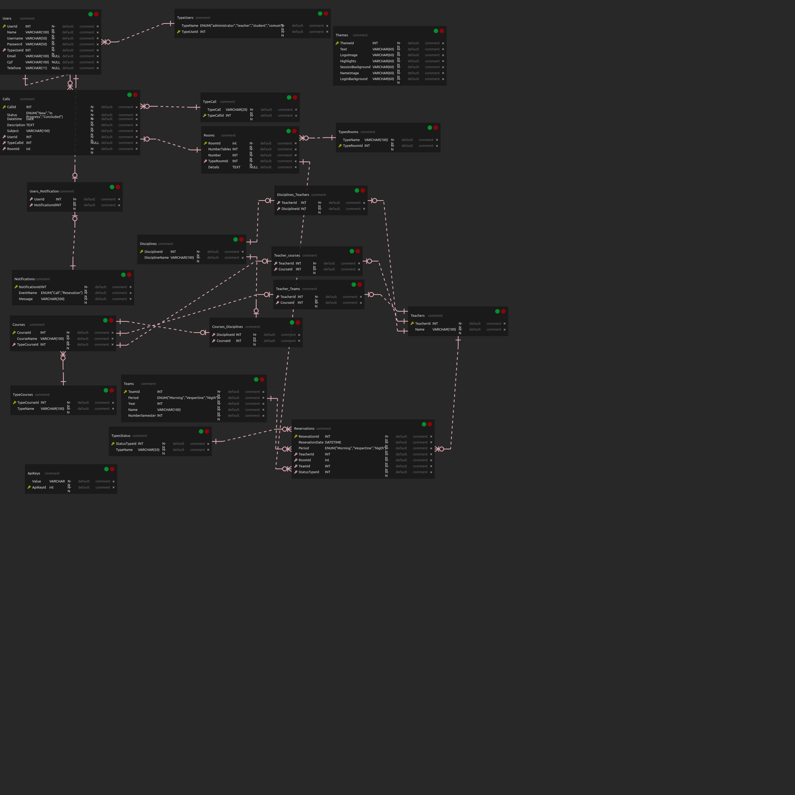

# SENAC-PAINEL

Aplicação para gerenciamento de salas 

## CONTEXTUALIZAÇÃO 

Uma `instituição de ensino` é composta por diferentes atores ou envolvidos e a Faculdade SENAC Florianópolis não difere de outras Universidades, pois conta com alguns colaboradores internos e clientes, a exemplo de alunos, professores, coordenadores, equipes administrativas, diretoria, equipe de TI, responsáveis pela manutenção e limpeza, entre outros.

Os `alunos`são os verdadeiros responsáveis pelas demandas da instituição de ensino e grande parte da comunidade acadêmica está separada por este importante público, que na Faculdade SENAC Florianópolis e considerada como cliente externo.
 
Os `professores` são responsáveis por abordar os conteúdos didáticos considerando a estrutura pedagógica e devem se adaptar de acordo com a estutura física disponível a cada período de aula. Estes atores, para lecionarem aos alunos das turmas, precisam dominar os assuntos propostos pelas disciplinas das diferentes unidades curriculares. Além da teoria, os professores também demandam por recursos físicos, a exemplo de espaço adequado, materiais para aprendizagem e os ambientes de interação para ampliar o aprendizado de cada discente ou turma. Neste contexto, a equipe administrativa ou a equipe de TI precisa disponibilizar as salas de aulas, os materiais didáticos, os kits de dinâmicas, os diários de classe e muitos outros recursos para uso do docente. 

Os `coordenadores de cursos` são responsáveis por planejar a estrutura do curso em conjunto com a `coordenação de núcleo`, organizar os recursos físicos necessários, operacionalizar a execução das disciplinas, distribuir o cronograma de aulas semestrais, mensal ou semanal, considerando a disponibilidade e os conhecimentos dos professores que compõem o quadro docente e as disciplinas que lecionam, para que o bom andamento dos cursos aconteçam em harmonia entre a comunidade acadêmica e também necessitando de alguns controles de atividades diárias, situações não convencionais e possíveis necessidades de correções ou ajustes com os professores ou equipes internas da instituição.

A `equipe administrativa` é responsável pela alocação de materiais, insumos para as aulas, ajustes de cronograma e adequação do calendário das aulas com os locais disponíveis na unidade, ou seja, as salas, os laboratórios e até mesmo o auditório. Nestes ambientes de ensino, as informações podem ser identificadas pelos seus números, seus tipos de carteiras ou mesas, quantidades de carteiras, mesas, micros, existência ou não de projetores, armários ou racks específicos, além de identificar o tipo de curso que poderá acontecer nestes ambientes, como curso técnico, formação inicial continuada, graduação, pós-graduação, atividade in-company, entre outros. Nestes ambiente o controle de horários e turnos de utilização, a rápida identificação de salas X cursos ou da disponibilidade de salas, tanto de manhã/tarde/noite, se torna uma das tarefas mais necessárias deste tipo de controle.

A `equipe de TI` é responsável por preparar os ambientes educacionais para uso dos professores, alunos ou coordenadores, a exemplo de laboratórios adequados, computadores em funcionamento, notebook´s de backup´s, projetores ajustados, softwares instalados e configurados, ou ainda, com as conexões entre a infraestrutura física dos equipamentos das diferentes redes em perfeito funcionamento.

A `equipe de manutenção e limpeza` é responsável por manter os ambientes utilizados em perfeitas condições de higiene e organização, adaptações de sala ou das necessidades de melhorias, correções de instalações ou substituições de equipamentos danificados, em todos os locais utilizados pelo público que utiliza as instalações da instituição de ensino.

À `direção da instituição` cabe as atividades estratégicas para identificar oportunidades, avaliar a viabilidade, recomendar novos investimentos, desenvolver novos negócios, além de dirigir, planejar, organizar e controlar as atividades das diversas áreas da Faculdade SENAC Florianópolis, fixando políticas de gestão dos recursos financeiros, administrativos, sua estruturação, racionalização e adequação dos serviços para melhor atender ao aluno que o principal cliente. 

Para que estes públicos tenham um controle mais assertivos dos cursos e das turmas que estão em andamento e para que haja controle dos recursos utilizados e diponíveis em um determinado período de tempo, seja ele diário, semanal ou mensal e ainda semestral ou anual, se faz necessário um controle de salas utilizadas, alocação dos cursos em execução, professores alocados nas disciplinas ou salas, disponibilidade de ambientes para uso ou para a oferta de novos cursos, bem como a quantidade estimada para ocupação de salas, entre outras informações.

## REQUISITOS

Considerando esta demanda específica da Faculdade SENAC Florianópolis, relaciona-se abaixo os requisitos essenciais para que seja desenvolvido um sistema para controle de distituição das salas de aulas, com seus professores. Considera-se na lista de requisitos funcionais, que para toda a indicação de `manter` tal funcionalidade", o sistema estará apto a realizar as operações de: Create, Read, Update e Delete, representados pela sigla CRUD, que significam em português as operações básicas  de criação, consulta, atualização e exclusão de dados nas respectivas tabelas de armazenamento destes dados.

### REQUISITOS FUNCIONAIS

- `RF-1:` Manter cursos - CRUD 

*exemplo*: 
- Jovem Aprendiz e Formação Inicial e Continuada 
- Livres 
- Técnicos 
- - Design de Interiores
- - Administração
- - Farmácia
- - Marketing 
- - ETC 
- Graduação
- - Gestão Comercial 
- - TGTI
- - Processos Gerenciais 
- - ADS
- - ETC 
- Pós-Graduação 
- - Títulos presenciais
- - Títulos a distância
- - MBA´s com algumas opções
  
- `RF-2:` Manter turmas - CRUD

- 1ª fase
- - TURMA (Matutino/Vespetino/Noturno) 
- 2ª fase
- - TURMA (Matutino/Vespetino/Noturno) 
- 3ª fase
- - TURMA (Matutino/Vespetino/Noturno) 
- 4ª fase
- - TURMA (Matutino/Vespetino/Noturno) 
- 5ª fase
- - TURMA (Matutino/Vespetino/Noturno) 

*exemplo*:

- 1ª fase ADS  
- 3ª fase PG Noturno 
- 5ª fase TGTI Noturno 
- 4 fase GC Noturno 
- Pós Lato Sensu Gerenciamento de Projetos 2020 
- Pós LS Semanal Segurança da Informação 2020 
- MBA Inovação 2019 
- Jovem Aprendiz em Serviços Administrativos 
- Aprendizagem Comercial em Vendas 
- Aprendizagem Comercial em Supermercados 
- ETC

- `RF-3:` Manter disciplinas - CRUD

- ADS 
- - Modelagem de Dados 
- - Engenharia de Requisitos ..ETC
- TGTI
- - Governança de TI 
- - Planejamento Estratégico ..ETC
- MBA 
- - Inovação 
- - Empreendedorismo 
- - Gestão de Negócios 
- - Equipes Ágeis ..ETC
  
- `RF-4:` Manter professores - CRUD

*exemplo*:

- Modelagem de Dados
- - André Ulisses
- - Bruno Rafael
- - Paulo Henrique
- Engenharia de Requisitos 
- - Paulo Lapolli
- - Flávio
- - Francisco Teston
- - Thayse 
- Governança de TI
- - Flávio
- - Adriano Melo 
- - Thayse
- - Cecília 
- Planejamento Estratégico 
- - Ronaldo Pasquini
- - Thiago Marques
- - Paulo Henrique 
- Empreendedorismo 
- - Thiago Marques
- - Fábian
- - Rafael Guimarães
  
- `RF-5:` Manter salas - CRUD

- Sala
- - Número
- - Tipo (Laboratório, Normal)
- - Espaço disponível

*Obs*: Conforme planilha de ensalamento 
  
- `RF-6:` Manter reservas - CRUD

- Rerserva
- - Sala 
- - Horario
- - Turno
- - Professor
- - Curso
- - Disciplina

- `RF-7:` Manter usuários - CRUD

- Usuario
- - nome
- - username
- - password
- - tipo (admin, professor, manutenção, limpeza, aluno)
- - Log de ações na aplicação
  
- `RF-8:` Manter Limpeza - CRUD

- Limpeza  
- - Status
- - Nº Sala
- - Data
- - Horário
- - Usuário que limpou a sala

- `RF-9:` Manter manutenção - CRUD

- Manutenção  
- - Status
- - Sala
- - Data
- - Horario
- - Objeto a ser arrumado
- - Usuário que arrumou o objeto 

- `RNF- 10:` Emitir notificação - CRUD

- Notificação 
- - Usuario
- - Evento
- - Descrição  
- - Sala
- - ?Turno
- - Data
- - ?Objeto


### REQUISITOS NÃO FUNCIONAIS

- `RNF-1:` O sistema deve ter uma versão para uso em navegador / web browser
- `RNF-2:` O sistema deve ter uma versão em *mobile* híbrido (Android / iOS)
- `RNF-3:` O sistema deve ter seu *backend* construído em *node*
- `RNF-4:` O sistema deve ter seu *frontend* construído em *react*
- `RNF-5:` O sistema deve ter seu aplicativo *mobile* construído em *react-native*
- `RNF-6:` O sistema deve permitir a divisão dos períodos de uso das salas
- `RNF-7:` O sistema deve controlar a capacidade ou ocupação das salas conforme o seu tipo
- `RNF-8:` O sistema deve controlar os tipos de cursos (NEB, NES, FIC, Jovem Aprendiz, etc)
- `RNF-9:` O sistema deve permitir a manutenção de registros ou status das ocorrências das salas (à equipe de manutenção e/ou limpeza)


### REGRAS DE NEGÓCIO

- `RN-1:` O sistema não deve permitir a reserva da sala, caso a mesma já esteja reservada com o mesmo dia e turno por um professor

## BANCO DE DADOS

Etapa que contém os modelos essências para `schema` do banco de dados;  

### MODELO LÓGICO



### SCRIPT 

```sql
CREATE TABLE `users` (
  `userid` int PRIMARY KEY NOT NULL AUTO_INCREMENT,
  `firtname` varchar(30),
  `lastname` varchar(30),
  `age` int,
  `profile_image` varchar(20),
  `typeid` int,
  `reservationid` int,
   FOREIGN KEY (`typeid`) REFERENCES `types` (`typeid`),
   FOREIGN KEY (`reservationid`) REFERENCES `reservations` (`reservationid`),
);

CREATE TABLE `types` (
  `typeid` int PRIMARY KEY NOT NULL AUTO_INCREMENT,
  `name` varchar(15)
);

CREATE TABLE `halls` (
  `hallid` int PRIMARY KEY NOT NULL AUTO_INCREMENT,
  `number_hall` int NOT NULL,
  `floorid` int NOT NULL,
  `maintenanceid` int,
   FOREIGN KEY (`maintenanceid`) REFERENCES `maintenances` (`maintenanceid`),
   FOREIGN KEY (`hallid`) REFERENCES `floors` (`hallid`)
);

CREATE TABLE `floors` (
  `floorid` int PRIMARY KEY NOT NULL AUTO_INCREMENT,
  `number_floor` int NOT NULL,
  `hallid` int
);

CREATE TABLE `reservations` (
  `reservationid` int PRIMARY KEY NOT NULL AUTO_INCREMENT,
  `date_time` timestamp,
  `period` ENUM ('morning', 'afternoon', 'night')
);

CREATE TABLE `maintenances` (
  `maintenanceid` int PRIMARY KEY NOT NULL AUTO_INCREMENT,
  `description` varchar(255) NOT NULL,
  `status` ENUM ('new', 'in_progress', 'waiting', 'concluded'),
  `created_ed` timestamp,
  `updated_ed` timestamp
);

```

*Obs*: SQLLite, PostgressSQL e MYSQL 

## PADRÃO DE PROJETOS

- [MVC](encurtador.com.br/bdhtS) - MODEL'S, VIEW'S e CONTROLLERS 

## PROTOTIPOS

DEPENDE DA VALIDAÇÃO DOS OUTROS CAMPOS
