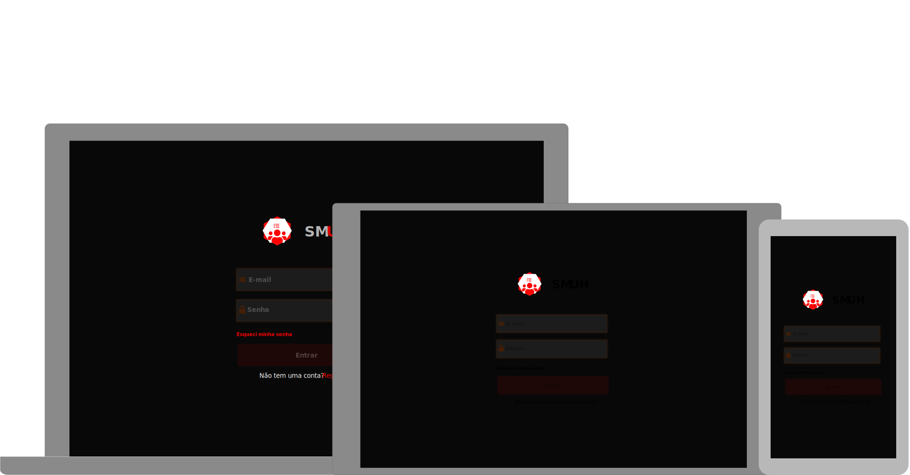

 


<p align="left">
  
</p>

<p align="center">
  
</p>

Aplicação para gerenciamento de salas 

## CONTEXTUALIZAÇÃO 

O cenário utilizado foi baseado na estrutura do SENAC

Uma `instituição de ensino` é composta por diferentes atores ou envolvidos e a Faculdade SENAC Florianópolis não difere de outras Universidades, pois conta com alguns colaboradores internos e clientes, a exemplo de alunos, professores, coordenadores, equipes administrativas, diretoria, equipe de TI, responsáveis pela manutenção e limpeza, entre outros.

Os `alunos`são os verdadeiros responsáveis pelas demandas da instituição de ensino e grande parte da comunidade acadêmica está separada por este importante público, que na Faculdade SENAC Florianópolis é considerada como cliente externo.
 
Os `professores` são responsáveis por abordar os conteúdos didáticos considerando a estrutura pedagógica e devem se adaptar de acordo com a estutura física disponível a cada período de aula. Estes atores, para lecionarem aos alunos das turmas, precisam dominar os assuntos propostos pelas disciplinas das diferentes unidades curriculares. Além da teoria, os professores também demandam por recursos físicos, a exemplo de espaço adequado, materiais para aprendizagem e os ambientes de interação para ampliar o aprendizado de cada discente ou turma. Neste contexto, a equipe administrativa ou a equipe de TI precisa disponibilizar as salas de aulas, os materiais didáticos, os kits de dinâmicas, os diários de classe e muitos outros recursos para uso do docente. 

Os `coordenadores de cursos` são responsáveis por planejar a estrutura do curso em conjunto com a `coordenação de núcleo`, organizar os recursos físicos necessários, operacionalizar a execução das disciplinas, distribuir o cronograma de aulas semestrais, mensal ou semanal, considerando a disponibilidade e os conhecimentos dos professores que compõem o quadro docente e as disciplinas que lecionam, para que o bom andamento dos cursos aconteçam em harmonia entre a comunidade acadêmica e também necessitando de alguns controles de atividades diárias, situações não convencionais e possíveis necessidades de correções ou ajustes com os professores ou equipes internas da instituição.

A `equipe administrativa` é responsável pela alocação de materiais, insumos para as aulas, ajustes de cronograma e adequação do calendário das aulas com os locais disponíveis na unidade, ou seja, as salas, os laboratórios e até mesmo o auditório. Nestes ambientes de ensino, as informações podem ser identificadas pelos seus números, seus tipos de carteiras ou mesas, quantidades de carteiras, mesas, micros, existência ou não de projetores, armários ou racks específicos, além de identificar o tipo de curso que poderá acontecer nestes ambientes, como curso técnico, formação inicial continuada, graduação, pós-graduação, atividade in-company, entre outros. Considerando este contexto, o controle de horários e turnos de utilização, a identificação rápida de salas disponíveis X cursos em andamento, quanto a disponibilidade geral de salas, tanto de manhã/tarde/noite, se torna uma das tarefas mais necessárias deste tipo de controle.

A `equipe de TI` é responsável por preparar os ambientes educacionais para uso dos professores, alunos ou coordenadores, a exemplo de laboratórios adequados, computadores em funcionamento, notebook´s de backup´s, projetores ajustados, softwares instalados e configurados, ou ainda, com as conexões entre a infraestrutura física dos equipamentos das diferentes redes em perfeito funcionamento.

A `equipe de manutenção e limpeza` é responsável por manter os ambientes utilizados em perfeitas condições de higiene e organização, adaptações de sala ou das necessidades de melhorias, correções de instalações ou substituições de equipamentos danificados, em todos os locais utilizados pelo público que utiliza as instalações da instituição de ensino.

À `direção da instituição` cabe as atividades estratégicas para identificar oportunidades, avaliar a viabilidade, recomendar novos investimentos, desenvolver novos negócios, além de dirigir, planejar, organizar e controlar as atividades das diversas áreas da Faculdade SENAC Florianópolis, fixando políticas de gestão dos recursos financeiros, administrativos, sua estruturação, racionalização e adequação dos serviços para melhor atender ao aluno que é o principal cliente. 

Para que estes públicos tenham um controle mais assertivos dos cursos e das turmas que estão em andamento e para que haja controle dos recursos utilizados e diponíveis em um determinado período de tempo, seja ele diário, semanal ou mensal e ainda semestral ou anual, se faz necessário um controle de salas utilizadas, alocação dos cursos em execução, professores alocados nas disciplinas ou salas, disponibilidade de ambientes para uso ou para oferta de novos cursos, bem como a quantidade estimada para ocupação de salas, entre outras informações.

## REQUISITOS

Considerando esta demanda específica da Faculdade SENAC Florianópolis, relaciona-se abaixo os requisitos essenciais para que seja desenvolvido um sistema para controle de distribuição das salas de aulas, com seus professores. Considera-se na lista de requisitos funcionais, que para toda a indicação de `manter` tal funcionalidade", o sistema estará apto a realizar as operações de: Create, Read, Update e Delete, representados pela sigla CRUD, que significam em português as operações básicas  de criação, consulta, atualização e exclusão de dados nas respectivas tabelas de armazenamento destes dados.

### REQUISITOS FUNCIONAIS

- `RF-1:` Manter cursos - CRUD 
- `RF-2:` Manter turmas - CRUD
- `RF-3:` Manter disciplinas - CRUD
- `RF-4:` Manter professores - CRUD
- `RF-5:` Manter salas - CRUD
- `RF-6:` Manter reservas - CRUD
- `RF-7:` Manter usuários - CRUD
- `RF-8:` Emitir notificação - CRUD
- `RF-9:` Manter Temas - CRUD

### REQUISITOS NÃO FUNCIONAIS

- `RNF-1:` O sistema deve ter uma versão para uso em navegador / web browser
- `RNF-2:` O sistema deve ter uma versão em *mobile* híbrido (Android / iOS) construídos em *react-native*
- `RNF-3:` O sistema deve ter seu *backend* construído em *node*
- `RNF-4:` O sistema deve ter seu *frontend* construído em *react*
- `RNF-5:` O sistema deve permitir a divisão dos períodos de uso das salas
- `RNF-6:` O sistema deve controlar a capacidade ou ocupação das salas conforme o seu tipo
- `RNF-7:` O sistema deve controlar os tipos de cursos (NEB, NES, FIC, Jovem Aprendiz, etc)
- `RNF-8:` O sistema deve permitir a manutenção de registros ou status das ocorrências das salas (à equipe de manutenção e/ou limpeza)


### REGRAS DE NEGÓCIO

- `RN-1:` O sistema não deve permitir a reserva da sala ou ambiente, caso o mesmo já esteja reservada com o mesmo dia, turno e período por algum professor

## BANCO DE DADOS

Nesta etapa serão apresentados os modelos essenciais para elaboração, implantação e utilização dos `schemas` do banco de dados  

### MODELO LÓGICO


Para visualizar o ERD instale a extensão em seu Visual Studio Code (VSCode) [dineug](https://marketplace.visualstudio.com/items?itemName=dineug.vuerd-vscode)

### SCRIPT 

```sql


CREATE TABLE ApiKeys
(
  Value    VARCHAR NOT NULL,
  ApiKeyId int     NOT NULL,
  PRIMARY KEY (ApiKeyId)
);

CREATE TABLE Calls
(
  CallId      INT                                   NOT NULL,
  Status      ENUM("New","In Progress","Concluded") NOT NULL,
  Datetime    Date                                  NOT NULL,
  Description TEXT                                  NOT NULL,
  Subject     VARCHAR(100)                          NOT NULL,
  UserId      INT                                   NOT NULL,
  TypeCallId  INT                                   NULL    ,
  RoomId      int                                   NOT NULL,
  PRIMARY KEY (CallId)
);

CREATE TABLE Courses
(
  CourseId     INT          NOT NULL,
  CourseName   VARCHAR(100) NOT NULL,
  TypeCourseId INT          NOT NULL,
  PRIMARY KEY (CourseId)
);

CREATE TABLE Courses_Disciplines
(
  DisciplineId INT NOT NULL,
  CourseId     INT NOT NULL
);

CREATE TABLE Disciplines
(
  DisciplineId   INT          NOT NULL,
  DisciplineName VARCHAR(100) NOT NULL,
  PRIMARY KEY (DisciplineId)
);

CREATE TABLE Disciplines_Teachers
(
  TeacherId    INT NOT NULL,
  DisciplineId INT NOT NULL
);

CREATE TABLE Notifications
(
  NotificationId INT                       NOT NULL,
  EventName      ENUM("Call","Resevation") NOT NULL,
  Message        VARCHAR(300)              NOT NULL,
  PRIMARY KEY (NotificationId)
);

CREATE TABLE Reservations
(
  ResevationId   INT                                  NOT NULL,
  ResevationDate DATETIME                             NOT NULL,
  Period         ENUM("Morning","Vespertine","Nigth") NOT NULL,
  TeacherId      INT                                  NOT NULL,
  RoomId         int                                  NOT NULL,
  TeamId         INT                                  NOT NULL,
  StatusTypeId   INT                                  NOT NULL,
  PRIMARY KEY (ResevationId)
);

CREATE TABLE Rooms
(
  RoomId       int  NOT NULL,
  NumberTables INT  NOT NULL,
  Number       INT  NOT NULL,
  TypeRoomId   INT  NOT NULL,
  Details      TEXT NULL    ,
  PRIMARY KEY (RoomId)
);

CREATE TABLE Teacher_courses
(
  TeacherId INT NOT NULL,
  CourseId  INT NOT NULL
);

CREATE TABLE Teacher_Teams
(
  TeacherId INT NOT NULL,
  CourseId  INT NOT NULL
);

CREATE TABLE Teachers
(
  TeacherId INT          NOT NULL,
  Name      VARCHAR(100) NOT NULL,
  PRIMARY KEY (TeacherId)
);

CREATE TABLE Teams
(
  TeamId         INT                                  NOT NULL,
  Period         ENUM("Morning","Vespertine","Nigth") NOT NULL,
  Year           INT                                  NOT NULL,
  Name           VARCHAR(100)                         NOT NULL,
  NumberSemester INT                                  NOT NULL,
  PRIMARY KEY (TeamId)
);

CREATE TABLE Themes
(
  ThemeId           INT         NOT NULL,
  Text              VARCHAR(60) NOT NULL,
  LogoImage         VARCHAR(60) NOT NULL,
  Highlights        VARCHAR(60) NOT NULL,
  SessionBackground VARCHAR(60) NOT NULL,
  NameImage         VARCHAR(60) NOT NULL,
  LoginBackground   VARCHAR(60) NOT NULL,
  PRIMARY KEY (ThemeId)
);

CREATE TABLE TypeCall
(
  TypeCall   VARCHAR(20) NOT NULL,
  TypeCallId INT         NOT NULL,
  PRIMARY KEY (TypeCallId)
);

CREATE TABLE TypeCourses
(
  TypeCourseId INT          NOT NULL,
  TypeName     VARCHAR(100) NOT NULL,
  PRIMARY KEY (TypeCourseId)
);

CREATE TABLE TypesRooms
(
  TypeName   VARCHAR(100) NOT NULL,
  TypeRoomId INT          NOT NULL,
  PRIMARY KEY (TypeRoomId)
);

CREATE TABLE TypesStatus
(
  StatusTypeId INT         NOT NULL,
  TypeName     VARCHAR(50) NOT NULL,
  PRIMARY KEY (StatusTypeId)
);

CREATE TABLE TypeUsers
(
  TypeName  ENUM("administrator","teacher","student","comum") NOT NULL,
  TypeUseId INT                                               NOT NULL,
  PRIMARY KEY (TypeUseId)
);

CREATE TABLE Users
(
  UserId    INT          NOT NULL,
  Name      VARCHAR(100) NOT NULL,
  Username  VARCHAR(50)  NOT NULL,
  Password  VARCHAR(50)  NOT NULL,
  TypeUseId INT          NOT NULL,
  Email     VARCHAR(100) NULL    ,
  Cpf       VARCHAR(100) NULL    ,
  Phone     VARCHAR(11)  NULL    ,
  PRIMARY KEY (UserId)
);

CREATE TABLE Users_Notification
(
  UserId         INT NOT NULL,
  NotificationId INT NOT NULL
);

ALTER TABLE Calls
  ADD CONSTRAINT FK_Users_TO_Calls
    FOREIGN KEY (UserId)
    REFERENCES Users (UserId);

ALTER TABLE Reservations
  ADD CONSTRAINT FK_Teachers_TO_Reservations
    FOREIGN KEY (TeacherId)
    REFERENCES Teachers (TeacherId);

ALTER TABLE Reservations
  ADD CONSTRAINT FK_Rooms_TO_Reservations
    FOREIGN KEY (RoomId)
    REFERENCES Rooms (RoomId);

ALTER TABLE Reservations
  ADD CONSTRAINT FK_Teams_TO_Reservations
    FOREIGN KEY (TeamId)
    REFERENCES Teams (TeamId);

ALTER TABLE Users
  ADD CONSTRAINT FK_TypeUsers_TO_Users
    FOREIGN KEY (TypeUseId)
    REFERENCES TypeUsers (TypeUseId);

ALTER TABLE Calls
  ADD CONSTRAINT FK_TypeCall_TO_Calls
    FOREIGN KEY (TypeCallId)
    REFERENCES TypeCall (TypeCallId);

ALTER TABLE Calls
  ADD CONSTRAINT FK_Rooms_TO_Calls
    FOREIGN KEY (RoomId)
    REFERENCES Rooms (RoomId);

ALTER TABLE Disciplines_Teachers
  ADD CONSTRAINT FK_Teachers_TO_Disciplines_Teachers
    FOREIGN KEY (TeacherId)
    REFERENCES Teachers (TeacherId);

ALTER TABLE Disciplines_Teachers
  ADD CONSTRAINT FK_Disciplines_TO_Disciplines_Teachers
    FOREIGN KEY (DisciplineId)
    REFERENCES Disciplines (DisciplineId);

ALTER TABLE Courses_Disciplines
  ADD CONSTRAINT FK_Disciplines_TO_Courses_Disciplines
    FOREIGN KEY (DisciplineId)
    REFERENCES Disciplines (DisciplineId);

ALTER TABLE Rooms
  ADD CONSTRAINT FK_TypesRooms_TO_Rooms
    FOREIGN KEY (TypeRoomId)
    REFERENCES TypesRooms (TypeRoomId);

ALTER TABLE Reservations
  ADD CONSTRAINT FK_TypesStatus_TO_Reservations
    FOREIGN KEY (StatusTypeId)
    REFERENCES TypesStatus (StatusTypeId);

ALTER TABLE Users_Notification
  ADD CONSTRAINT FK_Users_TO_Users_Notification
    FOREIGN KEY (UserId)
    REFERENCES Users (UserId);

ALTER TABLE Users_Notification
  ADD CONSTRAINT FK_Notifications_TO_Users_Notification
    FOREIGN KEY (NotificationId)
    REFERENCES Notifications (NotificationId);

ALTER TABLE Courses_Disciplines
  ADD CONSTRAINT FK_Courses_TO_Courses_Disciplines
    FOREIGN KEY (CourseId)
    REFERENCES Courses (CourseId);

ALTER TABLE Courses
  ADD CONSTRAINT FK_TypeCourses_TO_Courses
    FOREIGN KEY (TypeCourseId)
    REFERENCES TypeCourses (TypeCourseId);

ALTER TABLE Teacher_courses
  ADD CONSTRAINT FK_Teachers_TO_Teacher_courses
    FOREIGN KEY (TeacherId)
    REFERENCES Teachers (TeacherId);

ALTER TABLE Teacher_courses
  ADD CONSTRAINT FK_Courses_TO_Teacher_courses
    FOREIGN KEY (CourseId)
    REFERENCES Courses (CourseId);

ALTER TABLE Teacher_Teams
  ADD CONSTRAINT FK_Teachers_TO_Teacher_Teams
    FOREIGN KEY (TeacherId)
    REFERENCES Teachers (TeacherId);

ALTER TABLE Teacher_Teams
  ADD CONSTRAINT FK_Courses_TO_Teacher_Teams
    FOREIGN KEY (CourseId)
    REFERENCES Courses (CourseId);
```

*Obs*: SQLite, PostgreSQL e MySQL  (esta observação refere-se aos BD´s que serão possíveis de utilização, ou o SQLite é para *mobile* o PostgreSQL é para *web* e o MySQL para o *backend*? Ou haverá compatibilidade com todos estes BD´s?)

## PADRÃO DE PROJETOS

- [MVC](encurtador.com.br/bdhtS) - MODEL'S, VIEW'S e CONTROLLERS 

## PROTOTIPOS

<iframe style="border: none;" width="800" height="450" src="https://www.figma.com/embed?embed_host=share&url=https%3A%2F%2Fwww.figma.com%2Ffile%2FzFvY92WDwkqp19NGVvaJr2%2FSMUH%3Fnode-id%3D0%253A1" allowfullscreen>
</iframe>


## CONTRIBUIDORES 

|||
|:-:|:-:|
|@lucianokogut|@amazingbits|


## AUTOR 

||
|:-:|
|@jadson179|

